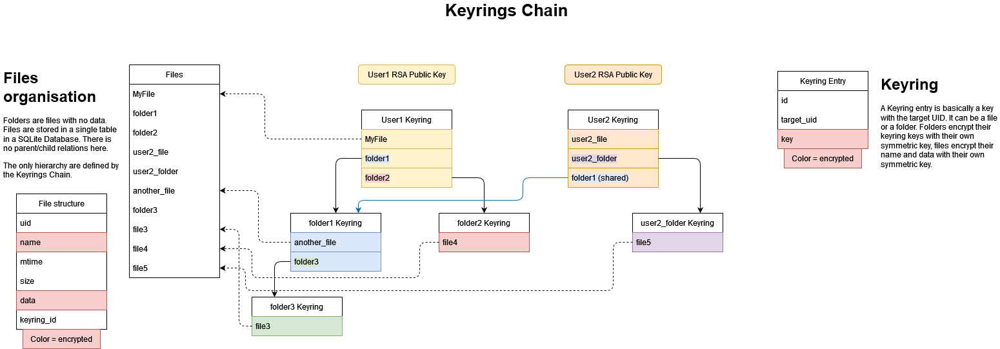
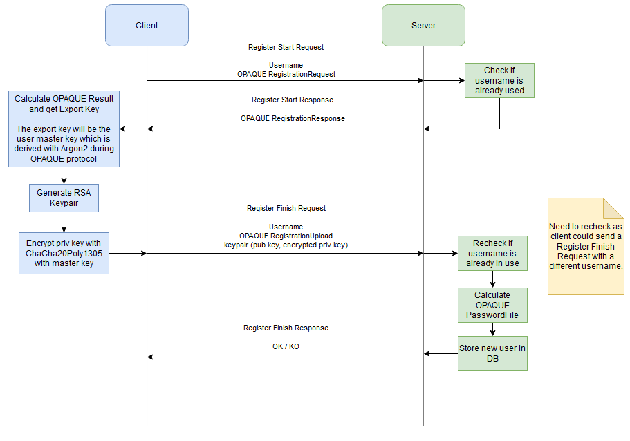
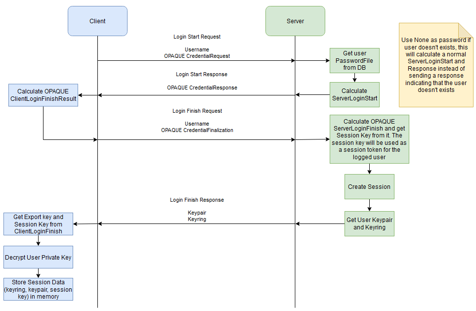

# CAA Project - Report

---

The goal of this project is to implement a simple but securised Shared Encrypted Network File System.

## Requirements

- Users should be able to log into the system with a simple username/password.
- They should have to enter their password only once.
- Every file and folder should be protected against active adversaries. We don’t consider DoS, though.
- File and folder names should also be confidential. Folders structure and file sizes can leak.
- We assume that the server is honest but curious.
- Clients should be able to connect to the file system from any computer and change device as they want.
- A folder can be shared with another user. We assume that the list of users can be known to the users of the system. When a folder is shared, all its sub-folder and files are also shared.
- Access to a shared folder can be revoked by anyone having access to the folder. Bonus points if only the original owner can revoke.
- A user should be able to change their password.
- A possible list of features is: download file, upload file, create folder, share folder, unshare folder, change password.


## Architecture

The architecture is composed of a Server and a Client.

### Server

This is the endpoint on which users login. It manage users access and rights and the filesystem.  
The server must not see any raw data, all the encryption/decryption must be done client side !

### Client

CLI application that allow users to connect and manage theirs files on the server.  

### Communication

The Client and Server communicate through HTTPS only (no HTTP) using axum for the server.

## Technical implementations

### User Authentication

OPAQUE seems a good choice for the user authentication and a good opportunity to use it.

### User Registration

User registration with OPAQUE. When a user register, generate an Asymmetric Keypair client side, encrypt the private key with the master key, and send the encrypted private key and the public key to the server. This is required as we need Asymmetric encryption to allow file sharing and one of the requirement is that the user only need username/password to authenticate and can connect from any devices. The private key must be stored server side.

### Master Key

The Master Key is used to encrypt the user private key which is used to encryp his Root Keyring. Whitout the Root Keyring we can't do anything.  
The Master Key is the OPAQUE Export Key, which is derived from the password with Argon2 during the OPAQUE protocol.

### Filesystem

All the files and data are stored in a SQLite database. Files are stored as BLOB inside the database. As each user can have a different path to the same file, it is simplier to just store files without hierarchy inside a database. The User Files hierarchy is defined by his Keyring. (See Keys handling / File Sharing Section).

#### File encryption

Data must be authenticated (protection against active adversaries).

File are encrypted using Chacha20-Poly1305.  
User Asymmetric Keys are RSA 3072 keypair.

each file has it's own Asymmetric key. This will result in a huge amount of keys in the system. One key per file per user. As each user will have a copy of the file Asymmetric Key encrypted with their Public Key. As the encryption is authenticated and with a nonce, the size of each file will be a little higher than the raw content.

#### Keys handling / File Sharing

Since each file can have different keys, we need to store these keys somewhere.  
We can store it using a "Keyring". Each user has a Keyring stored on the server. Each key inside their Keyring is encrypted with their public key. When a user login, the server send their Keyring, the client decrypt it and then it can use the keys inside to decrypt files.

The User Keyring is in fact the Keyring for their "root folder". Each folder has his own Keyring, each Key inside the Keyring is encrypted using the folder Symmetric Key.
If a user want to share a folder with someone else, he can take the Symmetric Key of the folder he want to share, encrypt it using the destination User Public Key, send the share request to the server with the destination user and the shared folder with the encrpyted key. The server can push the encrypted key inside the destination User Keyring. The destination User has now access the shared fodler by decrypting the folder Symmetric Key and all the subsequent files and folder (as he can decrypt the Folder Keyring and all the keys inside). If a single file is shared, the destination User will only be able to decrypt the file as a file has no Keyring. We can see this Keyring system as a virtual filesystem. We can "mount" the user root keyring, then follow all subsequent Folder Keyring inside and results in a files hierarchy. Shared files and folder will be "mounted" in the User root.

Schema:  


#### File/Folder Sharing revocation

To revoke a file/folder sharing we can't just remove the key from the user Keyring. We need to generate a new key for the file or a new key for the folder and all subsequent files and folders and re-encrypt all. We also need to update the new keys in the keyrings of all the other users that have access to the file/folder.

#### File access rights

We have two way to verify is a given user has owner, read or write access to a file.  

1) Using "software" design. Store in a DB the rights of each user on the file/folder
2) Using cryptography with asymmetric crypto. Each file has 3 asymmetric keypairs: owner, read and write. When a user want to do an action on a given file, he need to verify a challenge prooving it has the corresponding private key. When we share a file with someone, we share the corresponding private key depending on the access we want to give. Note: Don't forget to regenerate new keypairs when revoking access !

## App flow schemas

### Registration



### Login



## How to build

1) Install SQLite on your device

You'll need sqlite3 libs on your path to build diesel_cli and the server app.
On Linux, install sqlite, on Windows this is a bit tricky. Use WSL or check online.

2) Install `diesel_cli` to run migrations: 

```
cargo install diesel_cli --no-default-features --features sqlite
```

3) Run migrations

Go to the server folder and run:

```
diesel migration run
```

4) Build

You can run:

```
cargo build
```

on the server and client folders.